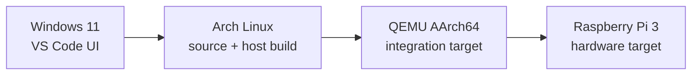
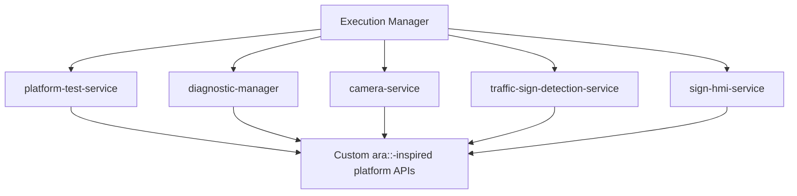

# Architecture Overview

## Intent

AdaptivePi is a clean-room, Adaptive AUTOSAR-inspired platform demonstrator. Its design emphasizes independently deployable processes, explicit lifecycle management, testable C++ components, and clear boundaries between platform APIs and applications.

## Development environments

Release 0 uses the Arch Linux host only. QEMU and Raspberry Pi validation are introduced in later releases.

## Intended target processes

## Layering rules

1. Applications use platform APIs rather than direct, ad-hoc logging, lifecycle, or diagnostics mechanisms.
2. Reusable business logic belongs in libraries; executable `main()` functions remain small.
3. Each service is independently buildable, testable, deployable, and observable.
4. The custom `ara::`-inspired interfaces are intentionally limited to the project’s needs. They are not an AUTOSAR implementation.
5. Host tests run first, followed by QEMU AArch64 integration tests and then Raspberry Pi hardware validation.

## Release 0 implementation

Release 0 currently provides:

- `platform-test-service`, a host-native C++ executable
- a testable core library containing its build identity
- GoogleTest unit tests
- Clang formatting and static analysis configuration
- CMake/Ninja build configuration