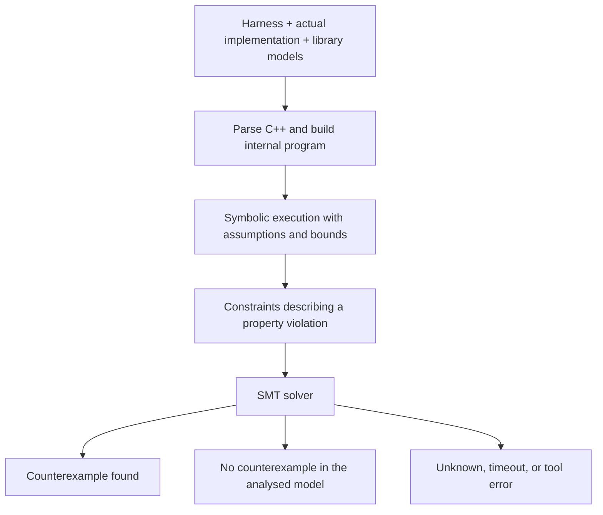

# ESBMC: understanding, writing, and running bounded proofs

This guide explains how AdaptivePi uses ESBMC, how to choose useful properties,
and how to write readable proof harnesses. The commands describe the current
repository integration and its pinned ESBMC **8.5** release. Upstream online
manuals evolve; check the installed binary's `--help` before adopting new options.

- [What ESBMC is](#what-esbmc-is)
- [How verification works](#how-verification-works)
- [Capabilities and repository recommendations](#capabilities-and-repository-recommendations)
- [When to add a proof](#when-to-add-a-proof)
- [Write a proof with Arrange, Act, Assert](#write-a-proof-with-arrange-act-assert)
- [Choose assumptions and bounds](#choose-assumptions-and-bounds)
- [Review and maintain proofs](#review-and-maintain-proofs)
- [Install and run ESBMC](#install-and-run-esbmc)
- [Register component proofs](#register-component-proofs)
- [Results and quality-gate mode](#results-and-quality-gate-mode)
- [Investigate a failed or inconclusive proof](#investigate-a-failed-or-inconclusive-proof)

## What ESBMC is

ESBMC means **Efficient SMT-Based Context-Bounded Model Checker**. It analyses
source code and asks whether a reachable execution can violate a property.
For C/C++, it supports user assertions and checks for classes of memory,
arithmetic, and concurrency errors. A property might be “an error code retains
its input value” or “this index never accesses outside the buffer.” See the
[upstream C/C++ overview](https://esbmc.github.io/docs/c-cpp/).

A **proof harness** is a small program that supplies inputs, calls the actual
implementation, and states what must hold. Its `main()` is the analysis entry
point. AdaptivePi's harnesses live in component `proofs/` folders and do not
become part of the ECU application binary.

In this repository, “proof” means a verification claim with an explicit scope:
source revision, input assumptions, library models, build configuration, bounds,
and enabled checks. It does not mean that the whole component is correct under
every possible environment.

| Technique | How AdaptivePi uses it | Evidence it provides |
|---|---|---|
| Compilation and clang-tidy | Build and analyse normal application code | Type/compile errors and selected diagnostic patterns |
| Unit tests | Execute selected cases using a native compiler and runtime | Observed behaviour for those cases |
| ESBMC harnesses | Analyse symbolic inputs and reachable paths within the configured model | Whether a specified property can fail within that scope |
| Integration and QEMU tests | Execute communicating processes and deployed applications | Observed behaviour with real process and OS interactions |
| Hardware measurements | Run on the target board | Timing and hardware behaviour under measured conditions |

Keep these forms of evidence together. For example, a proof about an integer
state transition does not demonstrate that systemd starts the process correctly.

## How verification works

**Symbolic execution** follows program operations using expressions for unknown
inputs. ESBMC translates the resulting execution constraints and the negation of
the property into a solver query. **SMT** means *Satisfiability Modulo Theories*:
the solver reasons about domains such as bit-vectors and arrays. Conceptually,
the question is:

```text
Can the input assumptions AND program behaviour AND a property violation
all be true in the analysed model?
```

A satisfiable query supplies a counterexample. An unsatisfiable query rules out
a counterexample in that model. A timeout or solver failure supplies neither
conclusion. See [SMT formula generation](https://esbmc.github.io/docs/theory/smt-formula-generation/).



A **nondeterministic input** stands for any value allowed by its type and the
harness assumptions. It is not a randomly selected test value. For example:

```cpp
extern unsigned int nondet_uint();
const auto input = nondet_uint();
```

ESBMC recognises the nondeterministic declaration; the harness does not supply
a normal runtime definition. Repeated calls can produce independent values.
The solver can reason about many combinations without executing a native test
once for each integer. See the [verification constructs reference](https://esbmc.github.io/docs/constructs/).

The practical limit is the size and complexity of the generated problem.
Symbolic inputs do not make arbitrary loops, containers, or thread schedules
cheap to analyse.

## Capabilities and repository recommendations

The following recommendations are AdaptivePi guidance, not new AUTOSAR
requirements. The installed executable's `--help` is the reference for the
options available in the pinned version.

| Capability | Current repository use | Recommended application |
|---|---|---|
| User assertions and invariants | Assertions in the two registered harnesses | First choice: precise relationships between inputs, outputs, and state |
| Pointer and array bounds checking | Enabled by ESBMC's defaults | Retain for every harness; particularly useful for views, buffers, and parsers |
| Memory-leak checking | `--memory-leak-check` in the shared runner | Retain; useful when a harness exercises allocation/ownership paths |
| Arithmetic overflow checks | Not explicitly enabled by the shared runner | Add `OPTIONS --overflow-check` for counters, lengths, offsets, and arithmetic policies where overflow is forbidden |
| Unsigned overflow checks | Not explicitly enabled | Consider `--unsigned-overflow-check` when unsigned wraparound violates the contract; document intentional modular arithmetic |
| Bounded state transitions | Available through ordinary symbolic inputs and assertions | Good future fit for lifecycle and restart-policy decisions |
| Race and deadlock checks | Not enabled in the baseline | Consider only for small, explicitly modelled concurrent algorithms with documented schedule bounds |
| Incremental checking and k-induction | Not selected by the current runner | Advanced follow-up when fixed bounds cannot express the intended claim |
| Counterexample traces | Saved in each failed proof's log | Use to identify inputs and control flow, then create a regression test where appropriate |

The [upstream concurrency guide](https://esbmc.github.io/docs/theory/concurrency/)
describes schedule exploration and context bounds. Concurrency checks concern
the modelled threads and synchronisation; they do not automatically verify a
Linux process fleet or every possible real-world schedule. More threads and
operations can substantially increase verification cost.

The [verification algorithms guide](https://esbmc.github.io/docs/theory/verification-algorithms/)
describes bounded checking, incremental strategies, and k-induction. Increasing
a bound is not itself an induction proof. An induction-based result requires
that strategy's proof obligations to succeed; enabling an option alone does not
establish an unbounded guarantee.

For this repository, prioritise small deterministic logic:

- **Existing foundation:** ErrorCode contents/comparisons. Result state and
  replacement invariants are candidates after validating support for the C++
  constructs involved. They are not part of the current proof suite.
- **Release 4 candidates:** manifest validation, permitted lifecycle transitions,
  and restart-policy decisions once their requirements and implementations exist.
- **Later communication/diagnostics candidates:** bounded message lengths,
  field validation, and small protocol state machines within approved scope.
- **Applications:** decision logic and data invariants that can be analysed
  independently of process startup, I/O, and deployment.

The metadata harness is a small example of application registration. It does not
make metadata the highest-value future verification target.

### Limits that matter here

C++ frontend support and library models have limits. Some language constructs
can fail analysis or be modelled imperfectly; operational library models are
simplifications, not the production STL. Check the
[upstream C++ limitations](https://esbmc.github.io/docs/c-cpp/limitations/)
when selecting a target or diagnosing a surprising result.

AdaptivePi runs host analysis with the model reported in the log. A Linux ARM64
installer asset is a binary that runs on that host; it is not evidence that a
proof models the Yocto target ABI. Do not infer target layout, alignment,
endianness, or timing properties from a host proof without validating those
model choices separately.

Use other verification for PREEMPT_RT latency, Ethernet hardware, filesystem
persistence, Linux/systemd behaviour, and real service recovery. ESBMC does not
establish AUTOSAR conformance, functional-safety qualification, or complete
system correctness for AdaptivePi.

## When to add a proof

Add or extend a proof when a useful property has many input combinations, the
code is tractable to analyse, and a counterexample would expose a meaningful
failure. Good triggers include a new bounded parser, a change to a state
transition table, a repaired boundary error, or a refactor of already-proved
logic. Rerun affected proofs when implementation, assumptions, models, compiler
mode, tool version, or bounds change.

Before writing one, answer:

1. What exact statement must hold, and where is its requirement or application
   contract documented?
2. Which real functions and source files implement that behaviour?
3. What can callers supply, including invalid inputs the implementation must
   reject?
4. What finite size or execution bounds make the analysis meaningful?
5. What remains outside the claim, and which other tests cover it?

A proof is not required for every component. The integration runs explicitly
registered harnesses under both `platform/` and `apps/`. The strict preset
requires a non-empty overall suite, not one harness in every folder. Additional
proof obligations should come from an agreed requirement or quality plan.
Existing requirement verification methods and statuses remain unchanged.

## Write a proof with Arrange, Act, Assert

Use a focused `proof_<property>.cpp` file and a descriptive, globally unique
CMake proof name. Keep one main property per harness; related assertions may
explain different parts of that property. Avoid a large `main()` that mixes
unrelated requirements.

Begin with a comment recording the contract, symbolic inputs, assumptions,
bounds, and exclusions. In the body use these three visible sections:

| Section | Contents | Review question |
|---|---|---|
| **Arrange** | Expected contract, symbolic inputs, valid initial objects, justified assumptions | Have we preserved all inputs relevant to the claim? |
| **Act** | Calls to the actual implementation | Are we exercising the production code rather than copying its algorithm? |
| **Assert** | Observable postconditions and state invariants | Would an incorrect result make an assertion fail? |

The following complete example presents the existing application metadata
property in this structure. It analyses the real `build_info.cpp`; it is a
teaching example, not an additional registered copy of the existing proof.

```cpp
#include "adaptive_pi/platform_test/build_info.hpp"

#include <cassert>
#include <cstddef>

extern std::size_t nondet_size();

/* Property: application metadata matches the documented build identity.
 * Trace: application-local contract; no AUTOSAR requirement ID.
 * Inputs: an unconstrained size_t character index.
 * Assumptions: no extra input restrictions; only valid indices are accessed.
 * Bound: unwind 32, including character-traits model loops; timeout 60 s.
 * Excludes: console output, main(), OS behaviour, and host STL correctness.
 * 1. Arrange: state expected metadata and choose a symbolic index.
 * 2. Act: obtain metadata from the actual application implementation.
 * 3. Assert: verify lengths and every in-range character.
 */
int main()
{
  /* Arrange */
  constexpr char expected_name[] = "platform-test-service";
  constexpr char expected_version[] = "0.2.0";
  const auto index = nondet_size();

  /* Act */
  const auto name = adaptive_pi::platform_test::ApplicationName();
  const auto version = adaptive_pi::platform_test::Version();

  /* Assert */
  assert(name.size() == sizeof(expected_name) - 1);
  assert(version.size() == sizeof(expected_version) - 1);
  if (index < name.size())
  {
    assert(name[index] == expected_name[index]);
  }
  if (index < version.size())
  {
    assert(version[index] == expected_version[index]);
  }
}
```

The index represents every `size_t` value. The branches make a character check
conditional on a valid index; the length assertions remain unconditional. Thus
an empty or incorrectly sized returned view cannot make the whole property pass
merely by skipping character checks. Expected strings come from the application
contract, not from calling the same implementation twice.

Register this shape with the real implementation source:

```cmake
add_esbmc_proof(platform-test-service-build-info
    SOURCES proof_build_info.cpp ../src/build_info.cpp
    INCLUDE_DIRECTORIES ../include
    UNWIND 32
    TIMEOUT 60
)
```

That name and registration already exist in
[the application proof manifest](../../apps/platform-test-service/proofs/CMakeLists.txt).
Do not register a second harness under the same name.

For requirement-based proofs, record the exact ID and the specific clause
covered. The [core proof](../../platform/ara-core/proofs/proof_error_code.cpp)
supplements ErrorCode contents and comparison verification; it does not prove
every clause of all associated requirements. Do not invent a requirement ID for
an application invariant or change an approved requirement to fit a harness.

## Choose assumptions and bounds

### Assumptions constrain the question

`__ESBMC_assume(condition)` excludes paths where the condition is false.
`assert(condition)` asks the checker to find a path where it is false. ESBMC
provides the former as a verification intrinsic. Keep ordinary assertions
enabled: defining `NDEBUG` can remove `<cassert>` checks. See the
[assert/assume reference](https://esbmc.github.io/docs/constructs/#assert-and-assume).

Use assumptions for genuine environmental preconditions. If the production
contract requires rejecting oversized input, preserve oversized symbolic inputs
and assert rejection. Assuming the input already fits would remove that case.
Never assume the postcondition you are trying to prove.

An impossible combination of assumptions can make assertions unreachable. This
is a **vacuous pass**: no permitted execution reaches the interesting check.
Review constraints together, not just individually. To test reachability during
development, temporarily place `assert(false)` at the point of interest: it
should fail if that point is reachable. Restore the assertion before committing.
This probe establishes reachability of that point, not complete harness quality.

### Bounds describe execution depth

`UNWIND` controls expansion of loops and recursive execution, not the number of
integer values considered. Library-model loops count too. For a fixed input
capacity, choose enough depth to analyse the longest relevant execution and
check the resulting log. Keep unwinding assertions enabled: they expose paths
that need more expansion. A failure of an unwinding assertion need not mean the
application property is false; it means the current bound is insufficient for
that path. See [upstream unwinding guidance](https://esbmc.github.io/docs/usage/#unwinding-assertions).

The current harnesses use 32 because their string operations include modelled
scans over short fixed literals. This is not a universal project bound. Future
parsers should explain their chosen input capacity; state-machine harnesses
should explain how many transitions they exercise. `TIMEOUT` is a resource limit,
not a proof bound or a success condition.

For sequences, Arrange supplies the initial state and symbolic events; Act
applies the events; Assert checks the invariant after each relevant transition.
A final-state-only check can miss an invalid intermediate state. Explain the
sequence limit separately from the loop unwind value, and do not claim that a
finite sequence establishes all possible service lifetimes.

## Review and maintain proofs

Keep a component `proofs/README.md` with the property, trace, inputs, assumptions,
justification of bounds, supported modes, exact reproduction command, observed
result, and exclusions. The runner logs the expanded command. For shared evidence,
also record the source revision, ESBMC version, platform/model, and exception mode.
A result belongs to that configuration and revision; it is not permanent evidence
for future changes.

Before considering a harness ready:

- Check that Act calls the real implementation and all required sources are
  included. Review missing-symbol diagnostics rather than treating an undefined
  production function like an intentional nondeterministic input.
- Check boundary and invalid inputs against the contract. Keep each assumption
  explained near the input it constrains.
- Keep memory and unwinding checks enabled. Justify per-proof options and any
  exclusions; do not disable a failing check just to obtain success.
- Keep assertions simple and based on the contract. Do not reproduce the
  implementation's algorithm as the expected answer.
- Deliberately break an assertion in a temporary copy and confirm that the runner
  fails and identifies the proof. Restore it and confirm a pass. Also check
  reachability of conditional assertions when assumptions could exclude them.
- Turn useful counterexamples into normal regression tests when possible, so
  the native compiler/runtime provide complementary evidence.
- Review configuration-dependent branches. Local evidence is exception-disabled;
  exception-enabled evidence remains a separate CI responsibility under
  [ADR 0006](../adr/0006-exception-build-policy.md).

Proofs can contain modelling mistakes. Review them as carefully as the code they
check. A mock or environmental model must be documented, and its behaviour must
preserve the cases needed by the claim.

## Install and run ESBMC

Native CMake configuration finds a host `esbmc` executable and runs every
explicitly registered proof under both `platform/` and `apps/`. If ESBMC is
missing, `scripts/install-esbmc.sh` downloads the official **8.5** release,
checks its pinned SHA-256, and installs the complete distribution under
`<build-directory>/tools/esbmc`. No root privileges or PATH changes are needed.

The installer supports Linux x86_64 and ARM64 hosts and requires Bash, curl,
unzip, coreutils, and util-linux (`flock`). The Linux x86_64 release has been
smoke-tested on the Arch development host. ARM64 installation has not been
executed locally. Downloads come from the
[official release](https://github.com/esbmc/esbmc/releases/tag/v8.5).

```bash
cmake --preset debug-esbmc-proofs
cmake --build --preset debug-esbmc-proofs
```

In VS Code, click the configure-preset entry in the status bar and choose
**Debug: ESBMC proofs**. The workspace already enables CMake presets and keeps
that selector visible. Alternatively run **CMake: Select Configure Preset** from
the Command Palette. Select the matching build preset if prompted. Configuring
runs the proofs; the Build button uses the matching `run-esbmc` target to rerun
only the proofs. The proof preset has its own build directory, disables unit-test
setup and clang-tidy, and requires a non-empty proof suite.

An existing executable is reused and checked with `--version`. Set
`-DESBMC_EXECUTABLE=/absolute/path/to/esbmc` to select an installation explicitly.
The installer pins downloads; an existing user-supplied version is not replaced.
For reproducible CI, install the pinned version in a fresh directory and select
that binary explicitly. Installation can also be run independently:

```bash
scripts/install-esbmc.sh build/tools/esbmc
cmake --preset debug-app \
  -DESBMC_EXECUTABLE="$PWD/build/tools/esbmc/bin/esbmc"
```

Installation uses a lock and a temporary directory, publishes only a validated
installation, and refuses to overwrite an incomplete destination. A working
installation is reused without network access. Download, checksum, and startup
errors stop configuration.

## Register component proofs

Use a `proofs/CMakeLists.txt` inside any component under either root:

```text
platform/ara-core/proofs/CMakeLists.txt
platform/ara-core/proofs/proof_result_state.cpp
apps/hello-adaptive/proofs/CMakeLists.txt
apps/hello-adaptive/proofs/proof_application_invariant.cpp
```

The central runner discovers these manifests. Component CMake files should not
also add their `proofs/` subdirectory. Only harnesses explicitly registered in
the manifests run; an unregistered `.cpp` file is not automatically verified.
Not every component must have proofs.

Example manifest, to use once the named harness exists:

```cmake
add_esbmc_proof(ara-core-result-state
    SOURCES proof_result_state.cpp
    INCLUDE_DIRECTORIES ../include
    UNWIND 8
    TIMEOUT 60
)
```

Names must be globally unique and contain only letters, digits, underscores, or
hyphens. `SOURCES` may include implementation files required by the harness;
compiled CMake libraries are not automatically linked into ESBMC. Include paths
and source paths are relative to the proof manifest. `DEFINITIONS` accepts
macros without `-D`; `OPTIONS` accepts additional ESBMC arguments. Document each
property, input assumptions, bound, timeout, additional options, and excluded
behaviour beside its harness. Do not use options that suppress the property
being checked or unwinding failures to manufacture a passing result.

The runner uses C++17, enables memory-leak checks, retains ESBMC's default
pointer/bounds checks and unwinding assertions, and passes the selected
`ADAPTIVE_PI_ENABLE_EXCEPTIONS` mode as both a frontend flag and macro. ESBMC
8.5 has `--no-pointer-check`, not `--pointer-check`; pointer checking is on by
default. Proofs are host analysis inputs and are not compiled into applications.
Local verification uses exceptions disabled; exception-enabled evidence belongs
in CI, consistent with the project's exception policy.

## Results and quality-gate mode

Every registered proof is attempted, even after an earlier proof fails. CMake
prints its name and command, writes the command, exit result, stdout, and stderr
to `<build-directory>/esbmc/logs/<proof-name>.log`, and fails the command if any
proof times out, cannot execute, returns a nonzero status, or lacks ESBMC's
`VERIFICATION SUCCESSFUL` result. Configuration and the `run-esbmc` build target
use the same generated command manifest and runner. The target always reruns
proofs, including after editing a harness without changing its manifest.

For a strict local or future CI quality gate:

```bash
cmake --preset debug-esbmc-proofs
cmake --build --preset debug-esbmc-proofs
```

The preset sets `ADAPTIVE_PI_ENABLE_ESBMC=ON` and
`ADAPTIVE_PI_ESBMC_REQUIRE_PROOFS=ON`. Strict mode rejects disabled verification
and an empty proof suite. Other native configurations run registered proofs too;
if none are registered, they warn that no project properties were verified.

The initial suite contains two supplementary proofs, both verified locally with
ESBMC 8.5 on Linux x86_64 and exceptions disabled:

| Proof | Property | Unwind / timeout | Result |
|---|---|---|---|
| `ara-core-error-code` | AP-R3-CORE-003 value and originating-reference retention; AP-R3-CORE-004 equality by value and domain ID | 32 / 60 seconds | Passed |
| `platform-test-service-build-info` | Metadata view lengths and contents match the application's existing contract for every valid symbolic index | 32 / 60 seconds | Passed |

See each component's `proofs/README.md` for assumptions and exclusions.
These do not establish the Release 4 harness baseline tracked by
[issue #41](https://github.com/Romanr92/adaptive-pi/issues/41).
This integration implements the installation and local CMake runner portion of
[issue #42](https://github.com/Romanr92/adaptive-pi/issues/42), including the
component-local layout discussed in its comment. It does not establish the PR
workflow or branch-protection gate; those require the supported proof baseline.

Use `-DADAPTIVE_PI_ENABLE_ESBMC=OFF` to disable installation and proofs for a
build. ESBMC defaults to off for target/cross builds; if explicitly enabled,
the executable is still searched on the host rather than in the target sysroot.
Existing CMake cache choices take precedence over defaults.

Passing bounded proofs establishes only the documented properties under their
assumptions and bounds. It does not verify the complete application, operating
system, hardware, or excluded third-party code, and does not replace unit tests
or target verification.

## Investigate a failed or inconclusive proof

Start with the named log under `build/debug-esbmc-proofs/esbmc/logs/`. Read the
expanded command and the violated property before changing a bound or harness.

| Symptom | Interpretation | Next step |
|---|---|---|
| Application assertion fails | A counterexample exists in the analysed model | Inspect its input values and state transitions; check implementation, harness, and model |
| Pointer, bounds, or leak check fails | A memory property failed along an analysed path | Identify the access/allocation and inspect its lifetime and input constraints |
| Unwinding assertion fails | A reachable path exceeds the configured expansion | Justify a larger bound or a contract-backed input limit; keep the unwinding check |
| Timeout, crash, or solver error | No successful proof result | Reduce the harness to the relevant property, investigate unsupported constructs, or adjust justified resource limits |
| Parsing or missing-header error | The program was not successfully analysed | Check source files, includes, definitions, and language support |
| Missing production symbol | A required implementation may not be included | Add the actual source or an explicitly reviewed environmental model |
| Success appears implausibly easy | The property might be trivial or unreachable | Inspect assertions, assumptions, `NDEBUG`, and perform a temporary failing-assertion probe |
| No registered proofs | No project properties were checked | Add an explicit manifest; the strict preset correctly rejects an empty suite |

A counterexample is evidence about the model. Reproduce it with native tests
where practical before concluding that it is a production defect. The existing
core harness binds returned references before comparing addresses because the
pinned frontend produced a surprising result for the equivalent address-of-call
expression; see its [scope notes](../../platform/ara-core/proofs/README.md).
Do not weaken the intended property to hide a tool limitation.

If **Debug: ESBMC proofs** is missing in VS Code, run `cmake --list-presets` in
its integrated terminal and check that the folder is this checkout. Then run
**Developer: Reload Window** and **CMake: Select Configure Preset**. A stale
preset list has been reported in
[CMake Tools](https://github.com/microsoft/vscode-cmake-tools/issues/3974).

For further study, start with the
[official usage guide](https://esbmc.github.io/docs/usage/),
[verification constructs](https://esbmc.github.io/docs/constructs/), and
[C++ limitations](https://esbmc.github.io/docs/c-cpp/limitations/).
The repository's pinned command and observed result take precedence over an
example for a newer upstream release.
